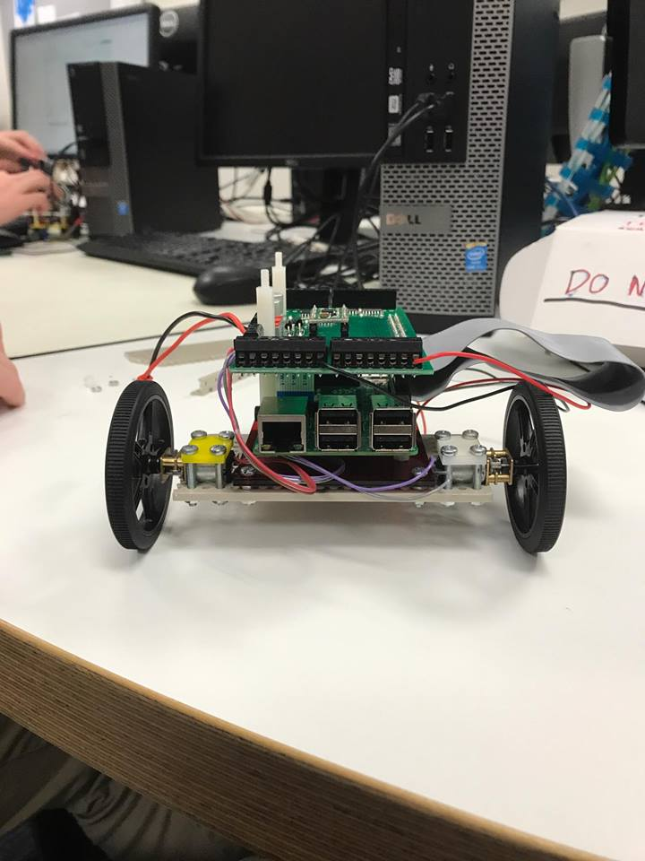
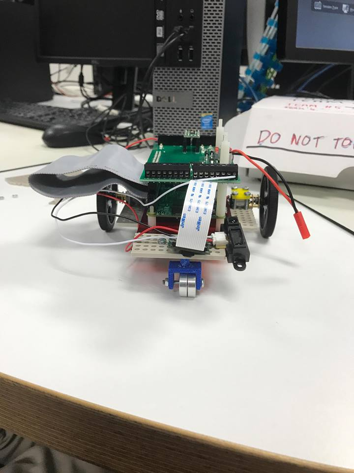
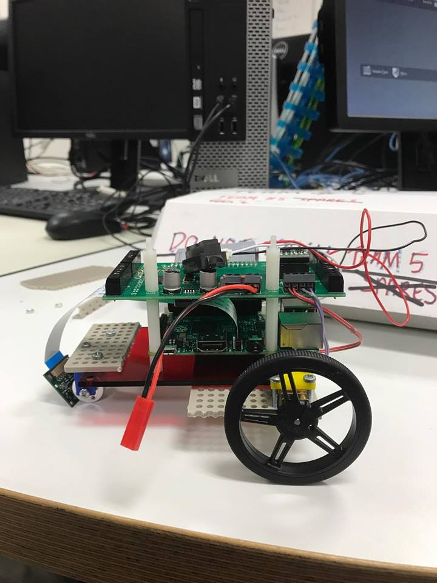

# Team *High Ground* AVC
![alt text][pic]

## Team Members
* Tom - Head of Software - tom.buurmans@gmail.com
* Isaac - Hardware - isaachamiltonj@gmail.com
* Xavier - Software - Xavier.Broadhead@gmail.com
* Raven - Head of Hardware - Ravengotztier@icloud.com
* Luke - Admin - luke.honiss@gmail.com


## Information
* [Google Docs Link](https://docs.google.com/document/d/1r9uR-22ZHVupD0Ts2tCpkkdqB7kD9Vjael_ExiJzlJU/edit?usp=sharing)
    * This will be a general place for team members to put code snippets or paste pictures of progress and more general items that don't belong directly on this document.
* We are using a Facebook Group chat to communicate
<table>
   <th colspan="3">First robot design</th>
   <tr>
      <td></td>
      <td></td>
      <td></td>
   </tr>
</table>

## Coding Guidelines
* 4 spaces in place of a tab (can be configured through Geany)
* Comments before each method and wherever possible
* Using underscores (`_`) in variable and method names (e.g. `my_method()`, `my_var`)
* Constants will be in 'UPPER_CASE'
* Opening curly brace will be on the same line as the method/statement declaration (i.e.)
```c
int main() {
    if(true) {
        print("true");
    } else {
        print("false");
    }
    
    return 0;
}
```


## Project Plan
| Week | Dates | Objective | Items Due | Conflicts | Tasks |
| ---- | ----- | --------- | --------- | --------- | ----- |
| 1    | 1-5/5 | Robot Moving<br />Chassis Design | AVC Plan | | [W1 Checklist](https://github.com/LuciusDev/ENGR101-2017/blob/master/README.md#week-1) |
| 2    | 8-12/5 | Chassis Complete<br />Base Code | | | [W2 Checklist](https://github.com/LuciusDev/ENGR101-2017/blob/master/README.md#week-2) |
| 3    | 15-19/5 | Quad1&2 Complete | COMP102 Test | | [W3 Checklist](https://github.com/LuciusDev/ENGR101-2017/blob/master/README.md#week-3) |
| 4    | 22-26/5 |Quad3 Complete | AVC Progress | ENGR121 Test | [W4 Checklist](https://github.com/LuciusDev/ENGR101-2017/blob/master/README.md#week-4) |
| 5    | 29/5-2/6 | Quad4 Complete | **AVC Challenge** | | [W5 Checklist](https://github.com/LuciusDev/ENGR101-2017/blob/master/README.md#week-5) |


## Weekly Checklists
### Week 1
- [x] [ALL] Sort out team roles
- [x] [ALL] Team name
- [x] [ALL] Sign team agreement
- [x] [ALL] Create team schedule
- [x] [Luke] Setup team GitHub Repository
- [ ] [Raven] Ideal robot mockup

#### Review
We are still to complete the mockup for the robot and complete the chassis for the robot. We had problems with attaching the motors to the GPIO pins, however the code we wrote worked fine (examples/forward.cpp).


### Week 2
- [x] [Raven] Ideal robot mockup
- [ ] [Raven] Mounting for camera, IR, and motors
- [x] [Raven] Wheel guiding system
- [ ] [Raven] Finish chassis
- [x] [SOFTWARE] Camera code
- [ ] [SOFTWARE] Robot can follow line
- [ ] [SOFTWARE] WiFi gate works
- [ ] [SOFTWARE] Test code

#### Review
We have done a lot of work this week. We managed to make a basic robot chasis with the parts that we could get. We have not yet finished the chasis but are not too far off it. Our hardware team will be completing the chasis at home. The software is pretty much complete for quadrant 1 which is very helpful. All of the team except Luke will be comming back on friday to complete the chasis and tidy stuff up.

### Week 3
- [x] [HARDWARE] Complete CAD files
- [ ] [HARDWARE] 3d print parts
- [ ] [HARDWARE] Finish chassis
- [ ] [SOFTWARE] Test code
- [ ] [HARDWARE] Mount camera, IR, and motors
- [ ] [SOFTWARE] Robot can follow line
- [ ] [SOFTWARE] WiFi gate works
- [x] [SOFTWARE] Implement derivitive signal
- [ ] [SOFTWARE] Refine constants
- [ ] [HARDWARE] Refine Robot Design
- [ ] [ALL] Quad 1&2 complete

#### Review


### Week 4
- [ ] [ALL] Quad 3 complete

#### Review


### Week 5
- [ ] [ALL] Quad 4 complete
- [ ] [ALL] Finishing touches

#### Review


### Weekly Progress Checklist
* [ALL] Each member/team completed their valid tasks
* [ALL] New goal for each member/team
* [Luke] Next week finalised
* [Luke] Review completed
* [Luke] Meetings finalised
* [Luke] Updated GitHub
    * [ALL] Code/pictures etc. committed
* [ALL] Extra tasks discussed

[pic]: https://m.popkey.co/fe3716/AlpAp_s-200x150.gif "We have the high ground"
